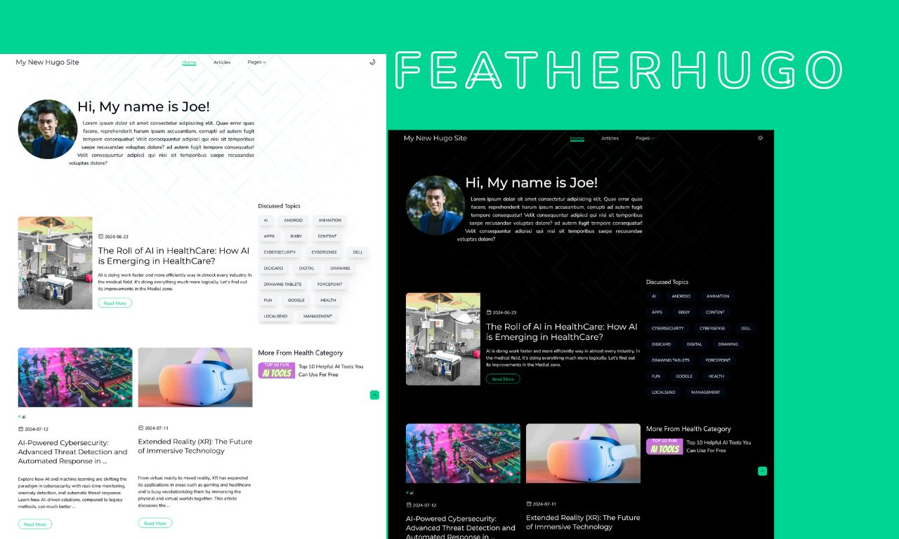

# FeatherHugo - Hugo Based Blog Theme
### [Click for demo](https://ibraheemguides.netlify.app/)



This is a standalone [Hugo](https://gohugo.io/) website powered by [Tailwind CSS](https://tailwindcss.com/) and includes enhanced interactivity via plugins like **Glider.js** and **FsLightbox**. It is designed for fast, responsive content-driven sites.

---

## 🚀 Features

- ⚡ Fast, static site generation with Hugo
- 🎨 TailwindCSS for utility-first styling
- 🖼️ Lightbox and carousel functionality with JavaScript plugins
- ✍️ Markdown-based content management
- 📁 Clean, organized folder structure
- 🔧 Easily customizable

---

## 📦 Installation

To run this Hugo site locally:

```bash
# Clone the repository
git clone https://github.com/Ibraheem-web/featherhugo.git
cd featherhugo

# Install dependencies
npm install

# Start Hugo development server
hugo server
```

Make sure you have both [Hugo](https://gohugo.io/getting-started/installing/) and [Node.js](https://nodejs.org/) installed.

**or**

Download the ZIP file from the GitHub repository.

Extract the ZIP file.

Open the extracted folder in your terminal.

Run the following commands:

```bash
# Install dependencies
npm install

# Start Hugo development server
hugo server
```

---

## 🗂️ Folder Structure

```
.
├── archetypes/         # Default content templates
├── assets/             # Tailwind CSS and JS assets
│   ├── css/
│   └── js/
├── content/            # Markdown content (articles, pages)
├── layouts/            # Template files
├── static/             # Static assets (images, favicon, etc.)
├── hugo.yaml           # Site configuration
├── package.json        # JS dependencies
└── ...
```

---

## ✏️ Customization

- **Basic**: Set site name and BaseURL in the `config.yaml` file. You can define how much blog posts you want to show on a list page by setting `pagerSize` in the same file.
- **Content**: Add new posts to `content/articles/` using Markdown. Each file supports front matter (YAML or TOML) for title, date, summary, and more.
- **Social Link**: Add link to your social media accounts in the `config.yaml` file under `params:` key.
- **Global Parameter**: Find more settings under `params:` key in the `config.yaml` file.
- **Featured**: You can feature a category and show all related posts to that one featured category by defining that category under the global parameter `featured_tag: health`, also you can feature a post by adding `type: featured` in the post's metadata.
- **Design (Colors & Fonts)**: You can easily customize the site's look and feel by editing the CSS variables defined in `assets/css/main.css`.

  Look for variables like:

  ```css
  @theme {
    --color-dark-primary: var(--color-gray-950);
    --color-light-primary: var(--color-gray-100);
    --color-brand: var(--color-emerald-400);
    /* ...other variables */
  }
  ```

  Note: Don't overwrite variables name, change the values instead.

- **Menus**: You can find header menu entries in `config.yaml` under main:

  ```yaml
  menus:
    main:
      - name: Home
        url: /
        weight: 10
      - name: Articles
        url: /articles/
        weight: 30
      - name: Pages
        weight: 40
        hasChidlren: true
      - name: Tags
        parent: Pages
        url: /tags/
        weight: 10
  ```  

  Find footer menu entries under footer key:

  ```yaml
  footer:
    - name: Home
      url: /
      weight: 10
    - name: Single
      url: /single/
      weight: 20
    - name: Articles
      url: /articles/
      weight: 30
  ```
---

## 📄 License

This project is open-source. You are free to customize, extend, and share.

---

Consider giving a star if you like it
